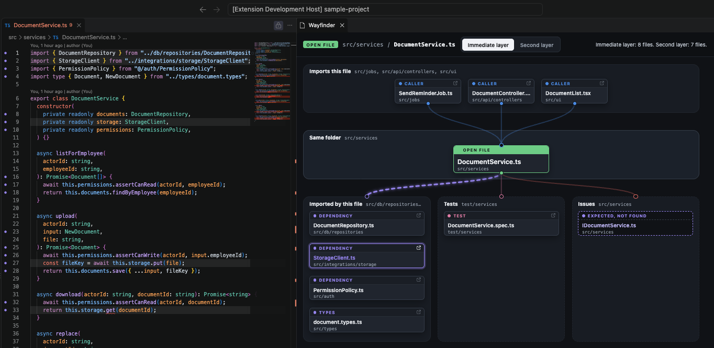
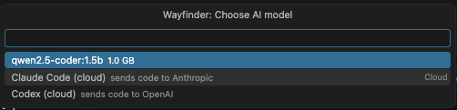
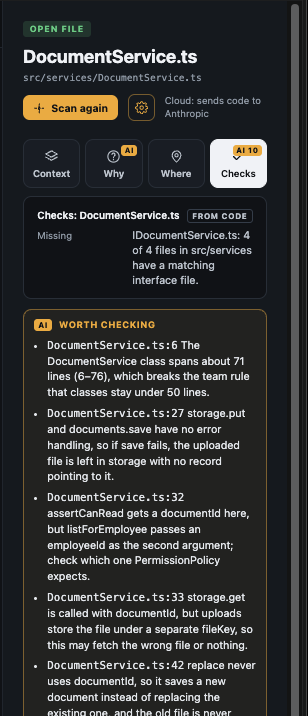
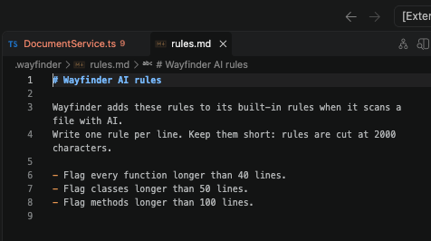

# Wayfinder

Shows where the open file sits in the codebase, in a panel beside the editor. The map's editor group is locked, so files you open from the explorer open in the other group.

- **Imports this file:** files that import the open file.
- **Imported by this file:** project files and packages the open file imports.
- **Members:** the functions, classes, methods and other names the open file defines, in source order. Click one to move the editor to its line.
- **Tests:** test files that import the open file.
- **Issues:** files the folder pattern expects but that are missing, and circular imports, listed in the side panel's Checks tab. A circular import also shows on the map as a red card under Imported by this file.
- **Second layer:** one more step out in both directions.

Everything above comes from the code. **Scan with AI** can add a summary and things worth checking for the open file, from a local Ollama model or from Claude Code or Codex. AI text is shown under the facts from code and never replaces them.

## Use

Open a TypeScript or JavaScript file and run **Wayfinder: Show map for this file**, or click the map button in the editor title bar.

Click a card to select it. The lines in the open file that use that file are highlighted. Coloured dots in the gutter mark the lines that use a file on the map, in that file's colour. Cmd+click (Ctrl+click on Windows and Linux) opens the file.

Click **Second layer** to see one more step out: the files that import the callers, and the files the imports use.

## AI scan

1. Install [Ollama](https://ollama.com) and pull a model, for example `ollama pull qwen2.5-coder:1.5b`.
2. Run **Wayfinder: Choose AI model** and pick one of your installed models. The cog next to **Scan with AI** in the side panel opens the same list. The choice is saved as `wayfinder.ai.model` in user settings. `wayfinder.ai.baseUrl` defaults to `http://localhost:11434`.

   

3. Hover the cog to see which model the scan uses. Press **Scan with AI** to scan the open file. The summary appears under Why, the findings under Checks.

  
  

### Privacy

- The map and the checks run on your machine and send nothing.
- With an Ollama model, the scan sends code only to Ollama at `wayfinder.ai.baseUrl`. With the default local address, code stays on your machine.
- With Claude Code or Codex, the scan sends code to Anthropic or OpenAI. See the next section for what is sent.
- With `wayfinder.ai.model` empty, AI is off and nothing is sent.

### Cloud: Claude Code or Codex

If `claude` or `codex` is on your PATH, the model list shows **Claude Code (cloud)** or **Codex (cloud)** under Cloud. The scan runs the CLI in headless mode with your existing login, so no API key is needed. Log in first with `claude auth login` or `codex login`.

A cloud scan sends the open file and the names of related files to Anthropic or OpenAI. With `wayfinder.ai.scope` set to `neighbours`, it also sends the code of the open file's imports, tests and callers. The first cloud scan in a workspace asks first. **Allow for this workspace** saves the answer for that workspace and that CLI. The side panel shows "Cloud: sends code to ..." while a cloud model is picked.

Findings that name a file or line outside the import map are dropped. Results are kept until the file, the rules or the scope change, or the panel closes.

### Rules and scope

- The scan sends the built-in rules, then the team rules in `.wayfinder/rules.md`, then your rules in `wayfinder.ai.instructions`. Team and user rules are added to the built-in rules. They do not replace them.
- Run **Wayfinder: Create AI rules file** to write a starter `.wayfinder/rules.md` and open it. An existing file is opened, not overwritten.

  

- Team and user rules together are cut at 2,000 characters to fit the model. The side panel then shows "Rules were cut to fit the model".
- `wayfinder.ai.scope`: `file` (default) sends only the open file. `neighbours` also sends the code of its direct imports, tests and callers, cut to fit. Neighbours are cut before the open file.

## Develop

    npm install
    npm run build
    npm test
    npm run package    # builds wayfinder-<version>.vsix

Press F5 to start the Extension Development Host with `test/sample-project`.

## Limits

- TypeScript and JavaScript only.
- Uses the first workspace folder and its root `tsconfig.json` or `jsconfig.json`.
- Unsaved changes show after the file is saved.

Forked from MapMyCode (MIT).
