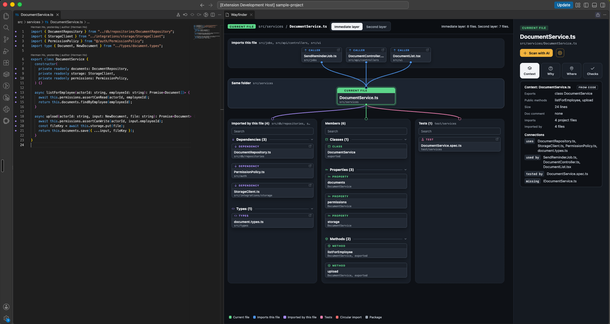
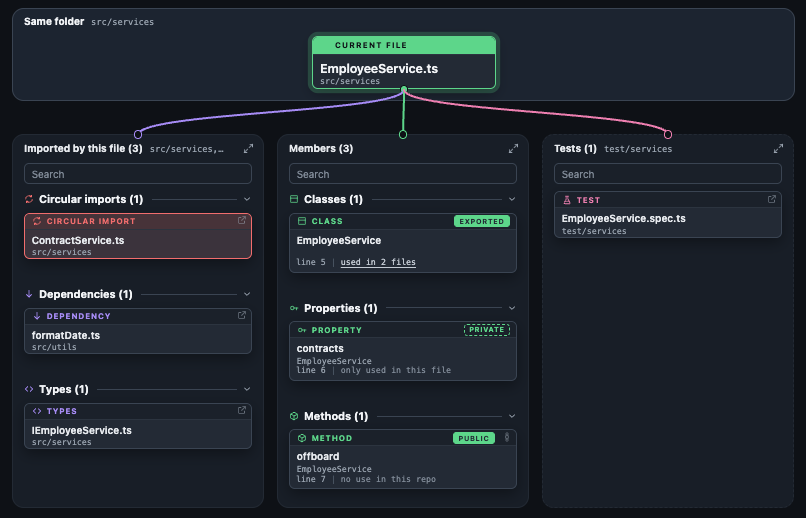
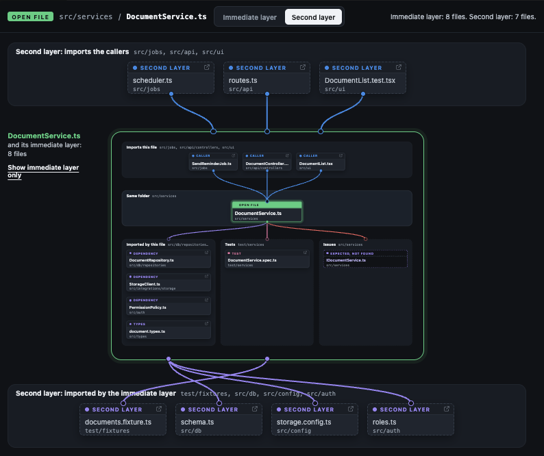
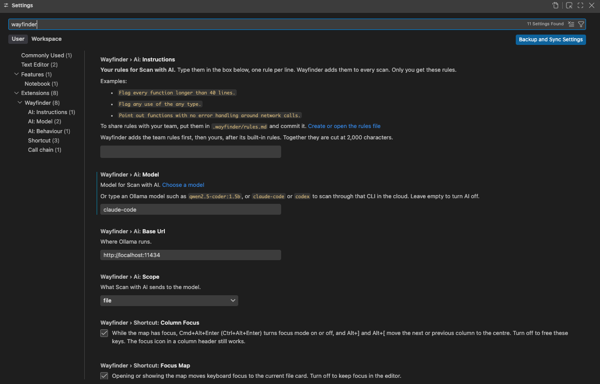
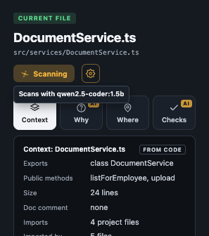
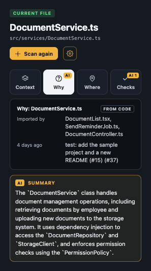

# Wayfinder

Shows where the open file sits in the codebase, in a panel beside the editor. The map's editor group is locked, so files you open from the explorer open in the other group.

- **Imports this file:** files that import the open file.
- **Imported by this file:** project files and packages the open file imports, grouped by kind: circular imports, dependencies, types, packages.
- **Members:** the functions, classes, methods and other names the open file defines, grouped by kind: classes, interfaces, types, enums, functions, constants, variables, properties, methods. In a test file it also lists test groups (`describe`, `context`, `suite`, `test.describe`) and test cases (`it`/`test`) in source order, with an `only` or `skip` tag. Click one to move the editor to its line. The card the editor cursor is in gets a ring, or its group heading when the card is hidden. Each card also shows its line and how many other files use it, for example `line 41 | used in 2 files`. Click the count to list those files with the line of their first use, and click a file to open it at that line. Exported functions, constants and classes count the files that import them by name. Methods and properties count the files that import the class and read a property with that name, without the type checker.
- **Tests:** test files that import the open file. When the open file is a test, this column is titled **Tested code** and has two groups. **Tested file**: the file it imports with the same name, or a file nearby with the same name, tagged "matched by name". `Foo.int.test.ts` and `Foo.e2e.spec.ts` match `Foo.ts`. **Other tests**: the other test files that import the tested file. When there are none, Checks says "No other test covers Foo.ts."
- **Issues:** files the folder pattern expects but that are missing, and circular imports, listed in the side panel's Checks tab. A circular import also shows on the map as a red card under Imported by this file.
- **Second layer:** one more step out in both directions.

The side panel describes the open file in four tabs:

- **Context:** exports, public methods, size, imports and connections.
- **Why:** the files that import it and its git history.
- **Where:** where it is defined and how it connects to other files.
- **Checks:** missing files and circular imports.

Cards sort A-Z within each group, and in Tests. Click a group heading to collapse or expand it. Each group, and the Tests column, shows 4 cards, then **Show N more**. Type in the search box of a column to show only the cards whose name contains the text, including cards in collapsed groups and past the first 4.

Everything above comes from the code. **Scan with AI** can add a summary and things worth checking for the open file, from a local Ollama model or from Claude Code or Codex. AI text is shown under the facts from code and never replaces them.

## Use

Open a TypeScript or JavaScript file and run **Wayfinder: Show map for this file**, or click the map button in the editor title bar, or press Cmd+Alt+M (Ctrl+Alt+M on Windows and Linux).

The shortcut opens or shows the map and moves keyboard focus to the current file card. Press it again while the map has focus to go back to the editor, with the cursor where it was. Two settings change this:

- `wayfinder.shortcut.focusMap` (default on): turn off to keep focus in the editor when the map opens or shows.
- `wayfinder.shortcut.returnToEditor` (default on): turn off and the shortcut does nothing while the map has focus.

To use another key, open Keyboard Shortcuts (Cmd+K Cmd+S, or Ctrl+K Ctrl+S), search for `Wayfinder` and change **Wayfinder: Show map for this file**. To go back to the editor with the same key, change **Wayfinder: Return to the editor from the map** too.

Click a card to select it. The lines in the open file that use that file are highlighted. Coloured dots in the gutter mark the lines that use a file on the map, in that file's colour. Cmd+click (Ctrl+click on Windows and Linux) opens the file.

To use the map with the keyboard:

- Arrow keys move between cards. Up and Down move within a column, Left and Right move to the first card of the next column. Up from the top of a column goes to the current file, then to **Imports this file**.
- Enter selects a file card, moves the editor to a member's line, or collapses and expands a group. Cmd+Enter (Ctrl+Enter) opens the file.
- `/` moves to the search box of the column you are in, or Members. Esc clears the search and moves back to the first card.

Click **Second layer** to see one more step out: the files that import the callers, and the files the imports use.

## AI scan

1. Install [Ollama](https://ollama.com) and pull a model, for example `ollama pull qwen2.5-coder:1.5b`.
2. Run **Wayfinder: Choose AI model** and pick one of your installed models. The list ends with **Turn off AI** (when a model is set) and **Open Wayfinder settings**. The cog next to **Scan with AI** in the side panel opens Wayfinder settings. The choice is saved as `wayfinder.ai.model` in user settings. `wayfinder.ai.baseUrl` defaults to `http://localhost:11434`.

   

3. Hover **Scan with AI** to see which model the scan uses. Press **Scan with AI** to scan the open file. The summary appears under Why, the findings under Checks.

  
  

### Privacy

- The map and the checks run on your machine and send nothing.
- With an Ollama model, the scan sends code only to Ollama at `wayfinder.ai.baseUrl`. With the default local address, code stays on your machine.
- With Claude Code or Codex, the scan sends code to Anthropic or OpenAI. See the next section for what is sent.
- With `wayfinder.ai.model` empty, AI is off and nothing is sent. Pick **Turn off AI** in the model list to clear it.

### Cloud: Claude Code or Codex

If `claude` or `codex` is on your PATH, the model list shows **Claude Code (cloud)** or **Codex (cloud)** under Cloud. The scan runs the CLI in headless mode with your existing login, so no API key is needed. Log in first with `claude auth login` or `codex login`.

A cloud scan sends the open file and the names of related files to Anthropic or OpenAI. With `wayfinder.ai.scope` set to `neighbours`, it also sends the code of the open file's imports, tests and callers. The first cloud scan in a workspace asks first. **Allow for this workspace** saves the answer for that workspace and that CLI. The side panel shows "Cloud: sends code to ..." while a cloud model is picked.

Findings that name a file or line outside the import map are dropped. Results are kept until the file, the rules or the scope change, or the panel closes.

### Rules and scope

- The scan sends the built-in rules, then the team rules in `.wayfinder/rules.md`, then your rules in `wayfinder.ai.instructions`. Team and user rules are added to the built-in rules. They do not replace them.
- Run **Wayfinder: Create AI rules file**, or click **Create or open the rules file** in settings, to write a starter `.wayfinder/rules.md` and open it. An existing file is opened, not overwritten.

- Team and user rules together are cut at 2,000 characters to fit the model. The side panel then shows "Rules were cut to fit the model".
- `wayfinder.ai.scope`: `file` (default) sends only the open file. `neighbours` also sends the code of its direct imports, tests and callers, cut to fit. Neighbours are cut before the open file.

## Develop

    npm install
    npm run build
    npm test
    npm run package    # builds wayfinder-<version>.vsix

Press F5 to start the Extension Development Host with `test/sample-project`.

## Limits

- TypeScript and JavaScript only.
- Uses the first workspace folder and its root `tsconfig.json` or `jsconfig.json`.
- Unsaved changes show after the file is saved.

Forked from MapMyCode (MIT).
