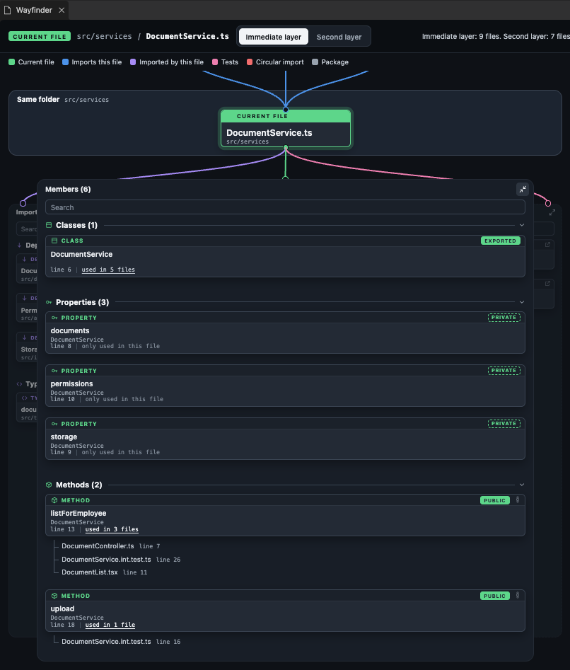
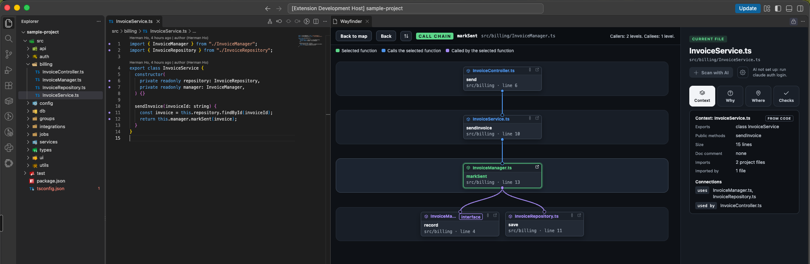

# Wayfinder

See where the open file sits in your codebase, in a panel beside the editor.

## The map

| Column | Shows |
|---|---|
| **Imports this file** | Files that import the open file |
| **Imported by this file** | Files and packages it imports, grouped by kind. Circular imports are red |
| **Members** | Classes, functions, methods and more, with a visibility tag and how many files use each one |
| **Tests** | Test files that import it |

The columns change with the file:

- **Interface:** the third column is **Implemented by**, with the classes that implement it and the interfaces that extend it.
- **React component:** the first column has a **Component tree** tab, and Members gets a **Props** group.
- **Test file:** Members lists the test groups and cases, and the third column is **Tested code**.

**Second layer** shows one more step out: who imports the callers, and what the imports use.

## Use

Open a TypeScript or JavaScript file and press **Cmd+Alt+M** (Ctrl+Alt+M), or click the map button in the editor title bar.

| Key | Does |
|---|---|
| Cmd+Alt+M | Open the map, or go back to the editor |
| Arrow keys | Move between cards |
| Enter | Select a card, or jump to a member's line |
| Cmd+Enter | Open the file |
| `/` | Search the column |
| Cmd+Alt+Enter | Focus mode on or off |
| Alt+] / Alt+[ | Next or previous column in focus mode |

Use Ctrl in place of Cmd on Windows and Linux. To change a key, search `Wayfinder` in Keyboard Shortcuts. The `wayfinder.shortcut.*` settings turn shortcuts off.

**Focus mode** gives one column the full width, for long names.

## Call chain

Put the cursor in a function and run **Wayfinder: Show call chain**, or click the call chain icon on a member card.

- Callers above, callees below, one row per depth, up to 3 levels each way.
- **deeper** loads one more level. The flip button swaps callers and callees.
- Only direct calls are shown. Calls through events, callbacks or dependency injection are not found.

## AI scan

Optional. Adds a summary and things worth checking, under the facts from code.

1. Install [Ollama](https://ollama.com) and pull a model, for example `ollama pull qwen2.5-coder:1.5b`. Or log in to the Claude Code or Codex CLI.
2. Run **Wayfinder: Choose AI model**.
3. Press **Scan with AI** in the side panel.

  
  

Add team rules in `.wayfinder/rules.md` (**Wayfinder: Create AI rules file**), or your own in `wayfinder.ai.instructions`.

### Privacy

- The map and the checks run on your machine and send nothing.
- Ollama: code goes only to `wayfinder.ai.baseUrl`, by default your own machine.
- Claude Code or Codex: the open file goes to Anthropic or OpenAI. Wayfinder asks before the first cloud scan in a workspace.
- `wayfinder.ai.scope` set to `neighbours` also sends its imports, tests and callers.
- No model set means AI is off and nothing is sent.

## Limits

- TypeScript and JavaScript only.
- Uses the first workspace folder and its root `tsconfig.json` or `jsconfig.json`.
- Unsaved changes show after the file is saved.

## Develop

    npm install
    npm run build
    npm test
    npm run package    # builds wayfinder-<version>.vsix

Press F5 to start the Extension Development Host with `test/sample-project`.

Forked from MapMyCode (MIT).
